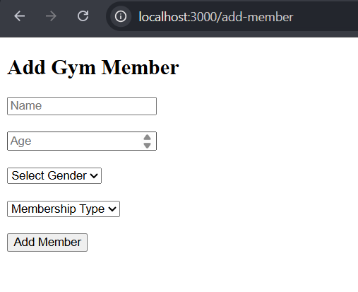
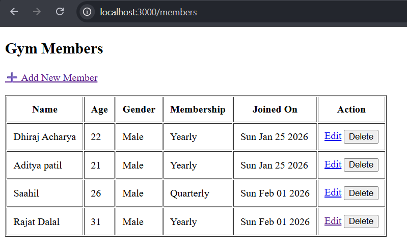
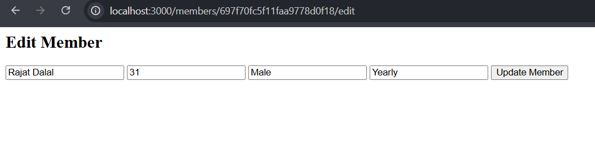
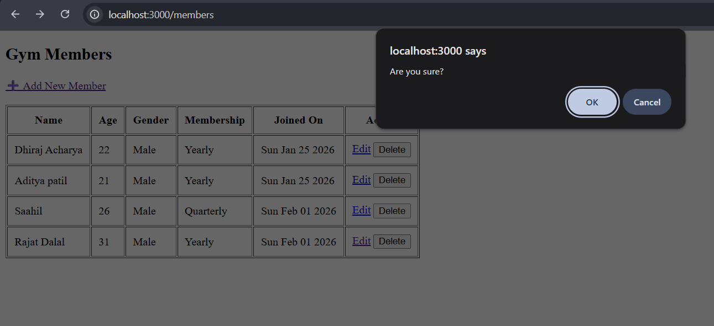

# Gym Member App

A web application to manage gym members and to track their subscriptions. Built using **HTML, CSS, JavaScript, Node.js, Express.js, and MongoDB**.

## Features

- Add, update, and delete gym members
- View all registered members
- Server-side rendering with EJS
- MongoDB data persistence
- Clean and responsive UI

## Tech Stack

- **Frontend:** HTML, CSS, TailwindCSS, JavaScript
- **Backend:** Node.js, Express.js
- **Database:** MongoDB, Mongoose
- **Others:** EJS for templating

## 📸 Screenshots

### ➕ Add Member

### 📋 Members List

### ✏️ Update Member

### 🗑️ delete member

